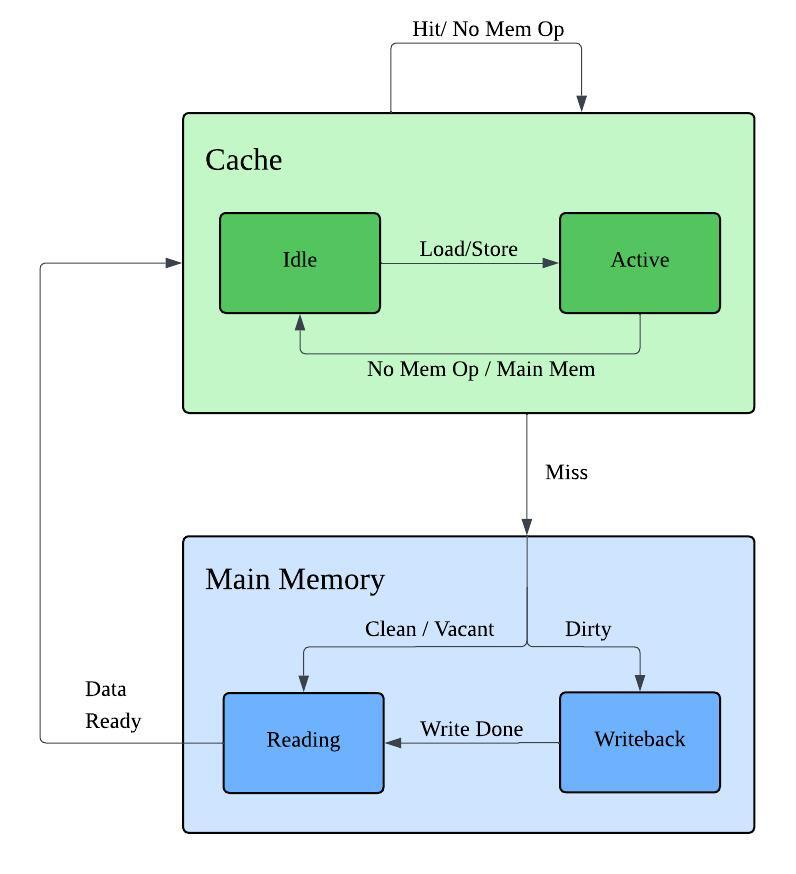
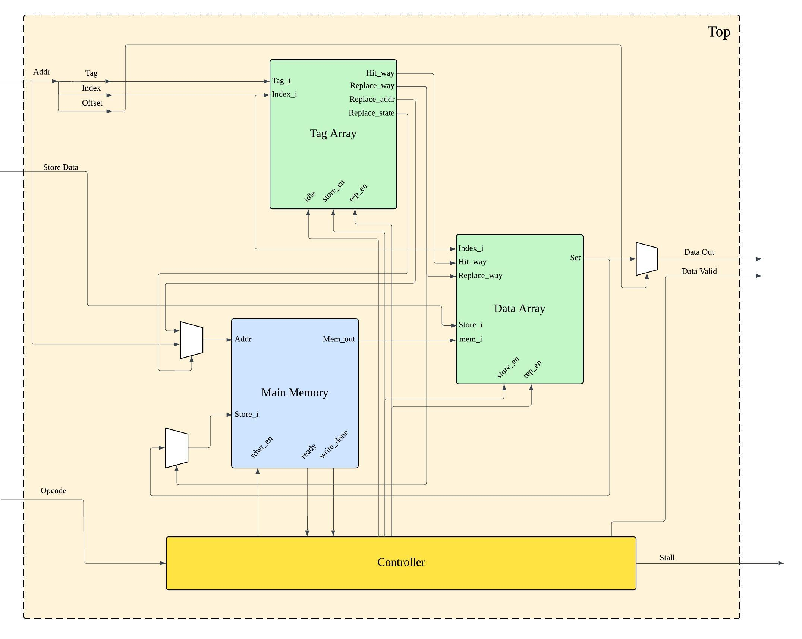

# ZeroCost-LLC
ZeroCost-LLC (ZCLLC) is a SystemVerilog implementation of a last level cache based on the ACM paper “High Performance and Predictable Shared Last-Level Cache for Safety-Critical Systems” by Zhuanhao Wu, Anirudh Kaushik, and Hiren Patel (ACM Transactions on Embedded Computing Systems, 2024).

# Supported Features 
- Parameterizable Set Associative Cache 
- Parameterizable Block size, memory depth, memory delay 
- LRU Replacement policy 
- Load/Store Support 
- Write back Cache 
- Parallel tag lookup and data access 

# Planned Improvements 
- Writeback Buffer 
- Parameterizable Tag Lookup Width
- FIFO Request and Response Buffer 
- Coherence Protocol Support, Back Invalidations 
- Cache Banks each with a read write port 
- UVM Testbench
- ZIV Implementation 
- ZCLLC Implementation 

# Architecture and State Diagram 


The Cache has two main states with further sub states in each. The Initial state is the cache state and this remains the state unless there is a miss during a memory operation such as a load or store. On miss the system transitions to the main memory state and returns to the cache state once data is ready. 
## Cache State: 
The Cache will start in an idle state if the main state is main memory or no memory operation is currently being requested. In the idle state the cache does not update LRU ages or evict any cache lines. The cache transitions to the active state when the main state is in cache and there is an active memory request. In this state the cache returns data upon hits and updates LRU ages accordingly, if there is a miss the cache will transition the main state to main memory and follow the eviction procedure. 
## Main Memory State: 
Upon misses the main state transitions to main memory, the default memory state will be reading and this will also be the state if the evicted line is clean or vacant. In the reading state the memory will retrieve the requested data by the cache. Once retrieved it will forward the data to the cache and transition the main state to the cache. If the evicted line is dirty the memory will start in the writeback state where the evicted line first writes its data to the memory and when finished the memory transitions to the reading state to retrieve the requested cache line. 

# Modules: 


The cache has four main modules. 
## Tag Array: 
The tag array stores the tags in a k-way set associative array. For each way it also stores the LRU ages and the cache line state(valid/clean, invalid/vacant, dirty). It does tag comparison and holds the LRU replacement logic. 
## Data Array: 
Data Array holds the cache lines in a k-way set associative array, it returns the entire set for parallel tag and data accesses.  
## Main Memory: 
The Main Memory stores data in cache lines depending on the set block size.
## Controller: 
The controller controls the state machine ensuring correct transitions and setting of control signals for the other modules. It also produces stalls when necessary. 

# Running the Cache 

To run simulation ensure verilator is installed and run the following command: 
```
make run
```

Then to view waveforms ensure GTKwave is installed and run the following:
```
gtkwave cache.vcd
```
